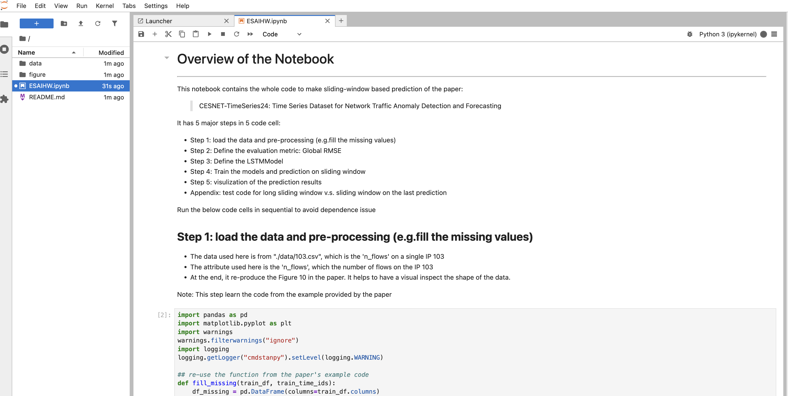

# ESnetAI
Repo for the Homework for ESnetAI Role

This Homework intends to re-produce the prediction of the number of IP flows (Fig. 10) in the paper with alternative methods

> Koumar, J., Hynek, K., Čejka, T. et al. CESNET-TimeSeries24: Time Series Dataset for Network Traffic Anomaly Detection and Forecasting. Sci Data 12, 338 (2025). https://doi.org/10.1038/s41597-025-04603-x

Note: since this is not research, my methods might be not as good as the paper.


# Steps to run the code
Below step assume python3 and git are installed on your system

## Step 1: Get the code and the data
 Git the code of this repo
```
git clone https://github.com/BinDong314/ESAIHW.git
```
```
> cd ESAIHW
> ls data   
103.csv			times_1_hour.csv
```
103.csv	 contains the time series data of IP address 103.
times_1_hour.csv is used to convert id_time in 103.csv to real-world time. 

## Step 2: Install and start jupyter lab
```
> cd ESAIHW
> python3.13 -m venv .venv # create a virtual environment to have clean setup
> source .venv/bin/activate
> pip install jupyterlab  # install jupyterlab to run code
> jupyter lab
```
A jupyter tab page will be open in your default web browser

## Step 3: Run the script in jupyter lab

Please open the notebook file in jupyter to see the instruction to run it. The ESAIHW.ipynb is the file to run. 




